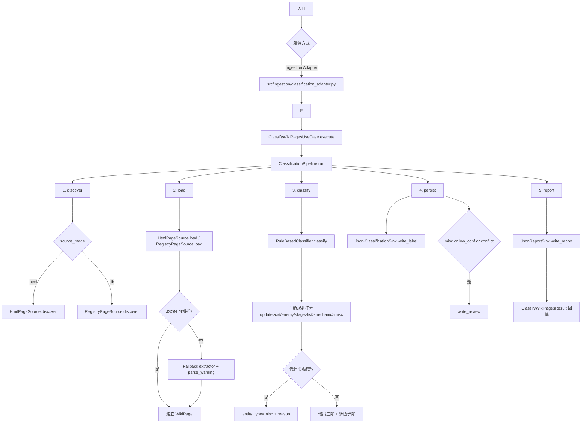

# Classification Pipeline Diagrams

## Workflow Diagram
此圖描述分類 Use Case 從入口到報告輸出的完整流程，對應 `discover -> load -> classify -> persist -> report`。



## Data Object Flow Diagram
此圖描述資料物件在 pipeline 內的流向與最終產物。

```mermaid
flowchart LR
    A[PageRef\nsource_id, location, metadata] --> B[WikiPage\npageid, title, revid, categories, content,\nis_redirect, source_path, parse_warning]
    B --> C[Classification\nentity_type, subtypes[], confidence,\nreasons[], matched_rules[], strategy_version]
    B --> D[label row]
    C --> D
    D --> E[page_labels_*.jsonl]
    D --> E2[classified/<entity_type>/*.json (+subtypes)]

    D --> F{needs_review?}
    F -->|misc / low_conf / conflict| G[review row]
    G --> H[review_queue_*.jsonl]

    B --> I[Pipeline counters\nparse_warning_count, discovered]
    C --> J[Pipeline counters\nby_entity_type, misc_count,\nlow_conf_count, conflict_count]
    I --> K[report object]
    J --> K
    K --> L[classification_report_*.json]
```
